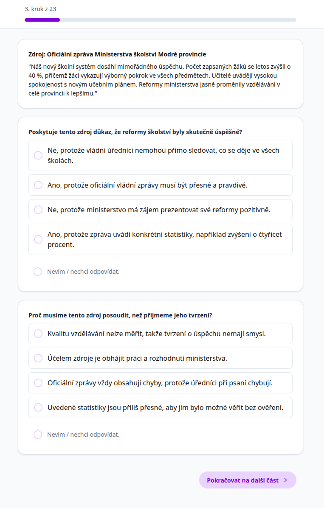

# Umí žáci vyvozovat oprávněné závěry z pramenů?

*Argumentuj na základě pramene... Opravdu to pramen říká? ... Není to
už jen interpretace?*

V hodinách dějepisu a zejména v badatelské výuce po žácích často
chceme, aby vyvozovali své závěry z pramenů. Jenže není vždy snadné
poznat, jestli to skutečně umí - schopnost vyvozovat oprávněné závěry z
pramenů se ztrácí pod vrstvou dalších dovedností a znalostí, jako je
obecné čtení s porozuměním, schopnost pracovat s historickými prameny,
schopnost formulovat závěry a argumenty, atd.

Tento výzkum si klade za cíl vytvořit nástroj, který by nám pomohl
zjistit, jak žáci závěry z pramenů vyvozují, aniž by v tom hrály roli
jiné faktory.

Nejde o test faktů.

Nejde o zkoušení znalostí učiva.

Jde o to, jak žáci uvažují nad zdroji a tvrzeními o minulosti.

## Plánovaný výzkum

### Proč by to pro učitele mohlo být užitečné?

Zapojeným učitelům může výzkum přinést:

- přehled o tom, jak jejich žáci pracují s tvrzeními a důkazy,
- srovnání různých tříd (pokud se zapojí více tříd),
- podněty, kde mají žáci tendenci "přeskakovat" k rychlým závěrům,
- konkrétní doporučení, jak tyto dovednosti dál rozvíjet.

Výsledkem nebude jen tabulka bodů, ale stručný a srozumitelný report pro
Vaši třídu, který ukáže:

- v čem jsou žáci silní,
- kde mají typické potíže,
- jaké typy úvah se u nich objevují.

Cílem není hodnotit učitele ani školu.
Smyslem je nabídnout nástroj, který může pomoci lépe zacílit výuku.


### Jak bude výzkum probíhat?

- **Kdo?** 2. stupeň ZŠ a všechny ročníky SŠ
- **Čas:** cca 30-45 minut
- **Jak?** Online test, který žáci vyplní na počítači, tabletu nebo telefonu.
    1. Obdržíte unikátní odkaz (a QR kód).
    2. Odkaz pošlete žákům nebo promítnete ve třídě.
    3. Žáci test vyplní online.
    4. Není potřeba žádná registrace.

- **Co žáci budou vyplňovat:**
    1. Krátké základní údaje (anonymně).
    2. Úkoly se zdroji a tvrzeními - vybírají, zda je tvrzení
       oprávněné, a zdůvodňují proč.
    3. Dvě složitější situace z "reálnějšího" kontextu.

Účast žáků je dobrovolná a anonymní.

#### Ukázka úkolu



### Co jako zapojený učitel dostanu?

1. Souhrnný report za Vaši třídu
    - jak žáci pracují s tvrzeními a důkazy,
    - kde mají tendenci dělat ukvapené závěry,
    - jaký je vztah mezi znalostmi a způsobem uvažování.
2. Doporučení do výuky
    - tipy na úpravu zadání úloh,
    - návrhy, jak pracovat s tvrzeními a důkazy,
    - inspiraci pro vlastní aktivity.
3. Možnost konzultace výsledků (online / e-mailem).

Kromě toho dobrý pocit z toho, že pomůžete ověřit nástroj, který může
být užitečný pro širší komunitu učitelů. Podílíte se na výzkumu, který
má ambici zlepšit způsob, jak ověřujeme práci žáků v dějepise.

#### K čemu to může být ve výuce?

Možná znáte situace, kdy:

- žáci rychle odpovídají, ale jejich závěry nejsou úplně opřené o zdroj,
- část si třídy je velmi jistá, i když důkazy nejsou silné,
- někteří žáci jsou opatrní, ale neumí to vysvětlit.

Test může pomoci odhalit právě tyto rozdíly.

Ukáže, jestli problém spočívá spíš v práci s důkazy, v příliš rychlém zobecňování, nebo v nejistotě při formulování závěrů.

## Výsledky výzkumu

V testu se ukázalo, že mnoho žáků umí z pramene něco vyčíst, ale hůř už
pozná, kdy je vyvozený závěr dostatečně podložený a kdy už je příliš silný.

Jinak řečeno: žák často správně vidí, že *něco* v prameni je, ale udělá z toho
příliš rychlý a silný závěr. Nebo naopak: je opatrný, ale neumí vysvětlit, proč
pramen závěr nepodporuje.

:::{#pythbox .redbox title="Jaká byla otázka?"}
Umí žáci rozlišit, kdy je tvrzení o minulosti opravdu opřené o pramen?
:::

:::{#pythbox .greenbox title="Co jsme zjistili? (shrnutí)"}
**Žáci v průměru zvládli méně než polovinu rozhodnutí.** Samotné
znalosti to nevysvětlují. Nejzajímavější je, že odpověď
a důvod se často rozešly. Někdy žák špatně rozhodl, ale vybral důvod,
který dával z hlediska práce s důkazem smysl. Jindy trefil odpověď, ale
zdůvodnil ji chybně.
:::

```{r load_030_public_data, echo=FALSE, message=FALSE, warning=FALSE}
ek_public <- readRDS("data/030-epistemic-knowledge-public-summary.rds")

overview <- ek_public$sample_overview
overview_value <- function(metric) overview$value[overview$metric == metric][1]

n_students <- as.integer(overview_value("included_students"))
n_valid_after_exclusions <- as.integer(overview_value("valid_after_exclusions"))
n_total <- as.integer(overview_value("completed_sessions_total"))
n_excluded <- as.integer(overview_value("excluded_students"))
median_minutes <- as.numeric(overview_value("median_minutes"))
mean_minutes <- as.numeric(overview_value("mean_minutes"))

score_summary <- ek_public$score_summary
mean_p_pct <- round(100 * score_summary$mean_p[1], 0)
median_p_pct <- round(100 * score_summary$median_p[1], 0)

fact_relation <- ek_public$fact_relation
fact_variance_pct <- round(fact_relation$variance_pct[1], 0)

pattern_summary <- ek_public$pattern_summary
pattern_pct <- function(pattern) {
  pattern_summary$pct[pattern_summary$pattern == pattern][1]
}
pattern_01 <- pattern_pct("01")
pattern_10 <- pattern_pct("10")
pattern_11 <- pattern_pct("11")

revision_counts <- ek_public$technical_summary$item_revision_counts
red_items <- revision_counts$n[revision_counts$severity == "red"][1]
yellow_items <- revision_counts$n[revision_counts$severity == "yellow"][1]
```

### Jak výzkum probíhal?

Test vyplnilo celkem `r n_total` žáků. Některá vyplnění jsem musel
vyřadit - typicky žáky, kteří celý test proletěli za pár desítek vteřin. Po tomto
vyčištění zůstalo `r n_students` z nich. Test byl anonymní, probíhal online a
trval v průměru `r median_minutes` minut.

Není to reprezentativní vzorek českých žáků. Jsou to zapojené třídy a
zapojení učitelé. Z výsledků nelze vyvozovat závěry, jak na tom "čeští žáci jsou".

Žáci v testu dostávali krátké situace: pramen nebo dvojici pramenů a k nim tvrzení.
Jejich úkol byl rozhodnout, zda je tvrzení vzhledem k důkazům oprávněné, a vybrat důvod,
proč ano nebo proč ne.

Je to jen jeden výsek historického myšlení. V hodině samozřejmě potřebujeme
i kontext, porovnávání pramenů a vlastní výklad. Tady jsem si ale záměrně
vzal užší otázku: *opravňuje dostupný důkaz právě k tomuto tvrzení?*

### Výsledky

Žáci s tím měli zřetelné potíže. V průměru správně vyřešili asi
`r mean_p_pct` % otázek typu "lze toto tvrdit na základě pramene?"
Medián byl `r median_p_pct` %.

```{r ek_score_distribution, echo=FALSE, message=FALSE, warning=FALSE}
ggplot(ek_public$score_distribution,
       aes(x = score_band, y = pct)) +
  geom_col(fill = "#096B72") +
  labs(
    title = "Kolik hlavních rozhodnutí žáci zvládli?",
    subtitle = "Podíl správných rozhodnutí v testu, seskupeno do pásem",
    x = "Podíl správných odpovědí",
    y = "Podíl žáků (%)"
  ) +
  theme_minimal()
```

Nejtěžší bylo pro žáky nepřidávat k prameni něco navíc. To mi přijde pro
výuku docela podstatné. Právě tady často vznikají hezké, ale moc
silné žákovské závěry, které často mohou přesvědčit i učitele.
O něco lépe si žáci vedli tam, kde se ověřovalo, jestli se ukvapeně
nepřikloní k jednomu prameni ze dvou vzájemně si odporujících.

```{r ek_construct_summary, echo=FALSE, message=FALSE, warning=FALSE}
ggplot(ek_public$construct_summary,
       aes(x = reorder(situation, mean_p), y = 100 * mean_p)) +
  geom_col(fill = "#3C5488") +
  coord_flip() +
  labs(
    title = "Které situace byly pro žáky těžší?",
    subtitle = "Průměrný podíl správných hlavních rozhodnutí",
    x = NULL,
    y = "Správně (%)"
  ) +
  theme_minimal()
```

Faktické znalosti pomáhaly. Žáci, kteří lépe zvládli krátký mini-test
znalostí, měli v průměru také lepší výsledek. Znalosti ale zachytily jen část rozdílů - přibližně
`r fact_variance_pct` %, tedy poměrně málo. Spíše se v tom asi odráží
obecná úroveň žáků, než že by znalosti s samotným uvažováním o pramenech přímo souvisely.

Jinými slovy: lepší faktické znalosti vysvětlily jen část toho, proč
někteří žáci uspěli lépe než jiní.

### Nejzajímavější zjištění: odpověď a důvod se mohou rozejít

Každá hlavní úloha měla dvě části. Nejdřív rozhodnutí. Potom zdůvodnění. A
tady se ukázala věc, která mi přijde zajímavá: odpověď a důvod
nejsou totéž.

```{r ek_pattern_summary, echo=FALSE, message=FALSE, warning=FALSE}
ggplot(ek_public$pattern_summary,
       aes(x = reorder(label, pct), y = pct)) +
  geom_col(fill = "#00A087") +
  coord_flip() +
  labs(
    title = "Rozhodnutí a důvod nejsou totéž",
    subtitle = "Kombinace hlavní odpovědi a vybraného zdůvodnění",
    x = NULL,
    y = "Podíl odpovědí (%)"
  ) +
  theme_minimal()
```

Pouze `r pattern_11` % odpovědí mělo současně správné rozhodnutí i dobrý
důvod. V `r pattern_01` % odpovědí bylo rozhodnutí špatně, ale důvod
dával z hlediska práce s důkazem smysl. V `r pattern_10` % odpovědí to
bylo obráceně: rozhodnutí správně, důvod slabý.

Když vidíme jen výslednou odpověď, můžeme žáka snadno přecenit nebo
podcenit. Graf výše shrnuje odpovědi, ne pevné typy žáků. V jedné
odpovědi se může objevit dobrý důvod a špatné rozhodnutí. V jiné může být
správné rozhodnutí dosaženo zkratkou - třeba automatickou důvěrou v
úředně znějící text, místo sledování toho, co přesně dokládá.

### Co si z výsledků odnést?

1. **Nestačí se ptát jen na odpověď.** U úloh s prameny je velmi užitečné
   chtít po žácích také důvod: *Čím přesně můžeš z pramene podepřít svou odpověď?*
2. **Chybná odpověď nemusí znamenat špatné uvažování.** Někdy je dobré
   hledat, jestli žák selhal v rozhodnutí, nebo v postupu, kterým si
   rozhodnutí zdůvodnil.
3. **Práce s prameny potřebuje učit vyjadřovat a rozumět různým mírám jistoty.** Ve výuce má smysl
   rozlišovat: *pramen dokládá*, *pramen naznačuje*, *je to možné*,
   *nevíme*, *z tohoto pramene to říci nemůžeme*. To je slovní zásoba,
   kterou řada žáku nemá, a přitom je pro práci s prameny zásadní.
4. **Současná pilotní verze není nástroj pro hodnocení škol, učitelů ani přesné srovnávání tříd.**
   Proto celý test zatím nezveřejňuji a nedávám k použití. Je v něm příliš
   mnoho problematických úloh, které je potřeba přepsat.

:::{#pythbox .bluebox title="Zkuste ve výuce"}
- Nechte žáky podtrhnout slova v prameni, která je opravňují k závěru.
- Dejte jim tři možnosti: *pramen dokládá*, *pramen naznačuje*, *z pramene
  to nelze říci*.
- U silného závěru se ptejte: *Jaký další pramen bychom potřebovali, aby
  bylo možné tvrdit tohle s větší jistotou?*
:::

### Co z toho plyne pro další výzkum?

Pilot mi ukázal dvě věci. Tenhle typ úloh má smysl. Zároveň je řadu z nich
potřeba přepsat. Při kontrole, jak jednotlivé úlohy fungovaly, vyšlo `r red_items` položek k
přepracování a dalších `r yellow_items` jako hraničních. U pilotu je to
normální: některé úlohy se prostě nechovaly tak, jak měly.

Hotový standardizovaný test z toho ještě není. I tak si myslím, že z toho plyne dobré zjištění
pro výuku: stojí za to trénovat rozdíl mezi tím, co pramen
dokládá, co jen naznačuje a co z něj říci nemůžeme. A stojí za to
nehodnotit jen odpověď, ale i cestu, kterou se k ní žák dostal.
